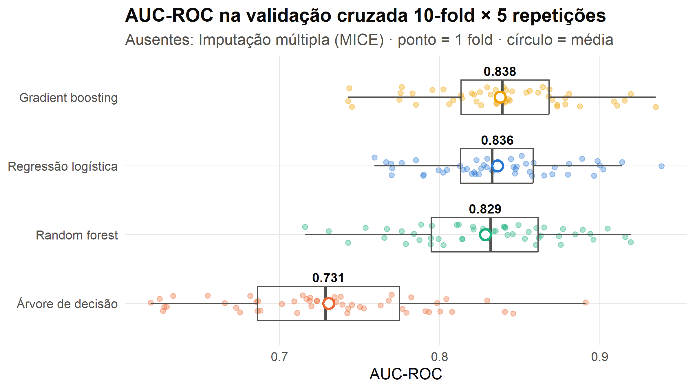
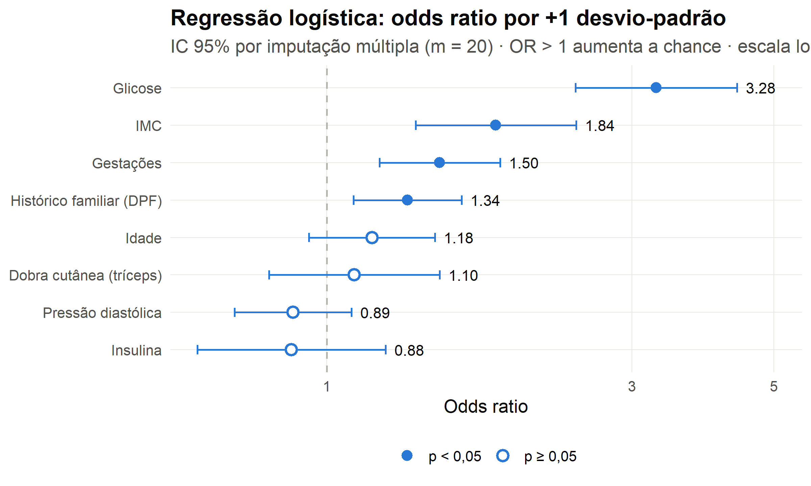
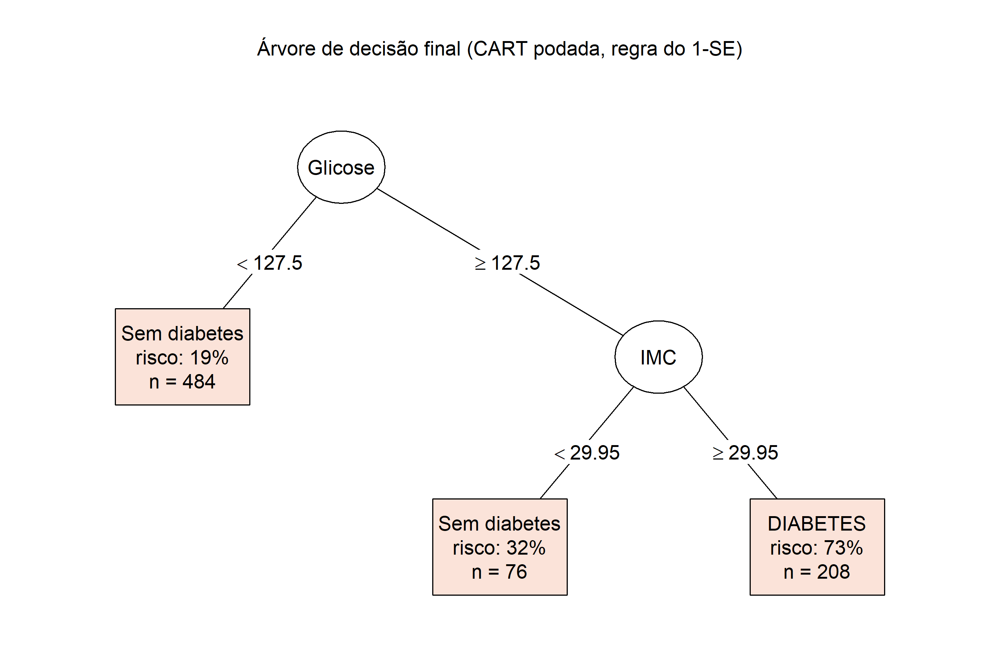
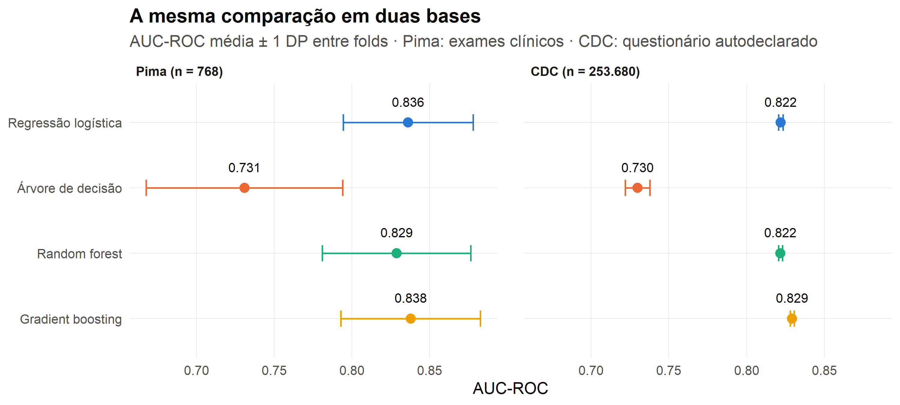

# Predição de diabetes por aprendizado de máquina supervisionado

**Uma comparação de modelos com ênfase em desempenho preditivo e interpretabilidade**

TCC · Universidade Presbiteriana Mackenzie — FCI
Lucas Bacil Karam · Israel Marcos Seixas Zibordi · Vitor Henrique de Lima Melo · Henrique Norio Tanaka Aidar Oliveira
Orientador pretendido: Prof. Julio Ardito

> **Questão de pesquisa:** qual modelo de aprendizado de máquina supervisionado apresenta o melhor
> equilíbrio entre desempenho preditivo e interpretabilidade clínica na classificação da presença de
> diabetes a partir de variáveis clínicas?

---

## Como rodar

Requer R ≥ 4.1. Os pacotes são instalados automaticamente pelo `R/00_setup.R` se faltarem.

```bash
Rscript run_all.R            # Pima: experimento completo (~2–3 min)
Rscript run_all.R --sem-cv   # reaproveita a validação cruzada já salva (~20 s)
Rscript run_cdc.R            # 2ª análise, base CDC (~50 min; rode depois do run_all.R)
Rscript run_cdc.R --sem-cv   # reaproveita a validação cruzada do CDC (~8 min)
```

No RStudio: abrir `projeto_tcc.Rproj` e rodar `source("run_all.R")`.
A saída do console fica em `resultados_log.txt` (Pima) e `resultados_cdc_log.txt` (CDC).
Guia detalhado de como o código funciona: [READMEfunc.md](READMEfunc.md).

## Estrutura

```
run_all.R                      roda tudo em ordem
R/00_setup.R                   pacotes, semente, parâmetros, rótulos e tema das figuras
R/funcoes.R                    tratamento de ausentes, os 4 modelos, métricas, teste estatístico
R/01_dados.R                   carga do Pima Dataset + análise exploratória
R/02_validacao_cruzada.R       CV estratificada 10-fold × 5 repetições (4 estratégias × 4 modelos)
R/03_comparacao.R              objetivos 2, 3 e 4 (tabelas + figuras)
R/04_interpretabilidade.R      odds ratios, árvore, importância das variáveis
R/cdc/                         2ª análise (base CDC), mesma numeração 00–04
run_cdc.R                      roda a 2ª análise
data/                          os dois datasets em CSV (Pima e CDC)
resultados/tabelas/            todas as tabelas (CSV) usadas no texto
resultados/figuras/            figuras em 300 dpi (prontas para o pôster)
resultados/cdc/                tabelas e figuras da 2ª análise
docs/                          rascunhos de texto para o Projeto Completo e o pôster
```

## Desenho do experimento

| Etapa | Decisão |
|---|---|
| Dados | Pima Indians Diabetes (cópia do `mlbench` 2.1-3.1 em `data/pima_bruto.csv`; o dataset foi removido do `mlbench` 2.1-10 e do UCI), 768 pacientes, 8 preditores, 34,9% com diabetes |
| Zeros inválidos | glicose, pressão, dobra cutânea, insulina e IMC iguais a 0 → tratados como ausentes |
| Estratégias de ausentes (obj. 4) | (a) zeros mantidos; (b) remoção de casos incompletos (392 pacientes); (c) imputação pela mediana; (d) imputação múltipla MICE/pmm. **Estratégia principal: MICE**, definida a priori |
| Sem vazamento | mediana e modelo MICE são aprendidos só no fold de treino e aplicados no de teste |
| Modelos | regressão logística; árvore CART podada pela regra do 1-SE; random forest (500 árvores); gradient boosting (`gbm`, profundidade 3, taxa 0,01, nº de árvores pelo erro OOB) |
| Validação | CV estratificada 10-fold repetida 5× = 50 avaliações por modelo; mesmos folds para todos |
| Métrica principal | AUC-ROC; secundárias: acurácia, sensibilidade, especificidade, precisão, F1, Brier (limiar 0,5) |
| Teste estatístico | diferença pareada de AUC com teste t corrigido para CV repetida (Nadeau e Bengio, 2003) |
| Critério do obj. 3 | perda de AUC > 0,05 ao trocar o melhor modelo pelo interpretável = perda clinicamente relevante |

## Resultados (semente 2026)

### Desempenho — estratégia MICE (média ± DP em 50 folds)

| Modelo | AUC | Acurácia | Sensibilidade | Especificidade | F1 | Brier |
|---|---|---|---|---|---|---|
| Gradient boosting | **0,838 ± 0,045** | 0,759 | 0,534 | 0,880 | 0,605 | 0,159 |
| Regressão logística | 0,836 ± 0,042 | **0,767** | 0,567 | 0,875 | 0,629 | **0,157** |
| Random forest | 0,829 ± 0,048 | 0,757 | **0,593** | 0,844 | **0,630** | 0,160 |
| Árvore de decisão | 0,731 ± 0,063 | 0,747 | 0,565 | 0,844 | 0,603 | 0,185 |



### Objetivos 2 e 3: vale a pena usar o modelo interpretável?

| Troca | Perda de AUC | IC 95% | Relevante (> 0,05)? |
|---|---|---|---|
| Gradient boosting → Regressão logística | 0,002 | [−0,015; 0,019] | **Não**, e o IC inteiro fica abaixo de 0,05 |
| Gradient boosting → Árvore de decisão | 0,107 | [0,064; 0,150] | **Sim** |

Os métodos ensemble **não** superaram a regressão logística de forma significativa (RF − LR = −0,007, p = 0,46;
GBM − LR = +0,002, p = 0,85). O resultado se repete nas quatro estratégias de ausentes.
**A regressão logística entrega o melhor equilíbrio**: desempenho equivalente ao melhor ensemble,
melhor calibração (menor Brier) e coeficientes diretamente interpretáveis. A árvore podada é a mais simples
de ler (3 regras), mas perde desempenho de forma clinicamente relevante.

### Objetivo 4: tratamento dos valores ausentes (AUC média)

| Modelo | Zeros mantidos | Casos completos* | Mediana | MICE |
|---|---|---|---|---|
| Regressão logística | 0,831 | 0,845 | 0,836 | 0,836 |
| Árvore de decisão | 0,714 | 0,765 | 0,731 | 0,731 |
| Random forest | 0,828 | 0,849 | 0,831 | 0,829 |
| Gradient boosting | 0,834 | 0,855 | 0,838 | 0,838 |

\* avaliado em outra amostra (392 pacientes, todos com insulina medida); a AUC maior **não** é comparável
diretamente e o desvio-padrão entre folds é maior (menos estável).

Tratar os zeros como ausentes melhora um pouco a AUC em todos os modelos (de +0,000 a +0,017), mas nenhuma
diferença pareada foi significativa. A árvore de decisão é o modelo mais sensível ao tratamento.

### Interpretabilidade

Glicose e IMC são as duas variáveis mais importantes **nos quatro modelos**. Na regressão logística,
+1 DP de glicose (≈ 30 mg/dL) triplica a chance de diabetes (OR = 3,05; IC 95% 2,38–3,90).
A árvore final resume o problema em 3 regras: glicose ≥ 127,5 **e** IMC ≥ 29,95 → risco de 73%.

| Odds ratios | Árvore final |
|---|---|
|  |  |

## Segunda análise: base CDC (replicação em larga escala)

A mesma comparação foi repetida no **CDC Diabetes Health Indicators** (UCI id 891, pesquisa BRFSS):
253.680 pessoas, 21 variáveis **autodeclaradas** (sem exames de laboratório), 13,9% com
**pré-diabetes ou diabetes**. Não é validação externa, porque as variáveis são outras. O objetivo é testar se a
conclusão do Pima se mantém numa base 330× maior. Detalhes do desenho em [READMEfunc.md](READMEfunc.md#10-segunda-análise-base-cdc).

| Modelo | AUC-ROC | AUC-PR | Brier | Sensib. / Especif. (limiar = prevalência) |
|---|---|---|---|---|
| Gradient boosting | **0,829 ± 0,001** | **0,430** | **0,097** | 0,765 / 0,736 |
| Regressão logística | 0,822 ± 0,001 | 0,405 | 0,099 | 0,768 / 0,723 |
| Random forest | 0,822 ± 0,001 | 0,421 | 0,098 | 0,803 / 0,685 |
| Árvore de decisão | 0,730 ± 0,008 | 0,310 | 0,106 | 0,681 / 0,706 |

*CV estratificada 5-fold × 2; AUC-PR de um classificador aleatório = 0,14.*



**O que muda com 330× mais dados:**

- **A diferença para a logística vira significativa, mas continua pequena.** O GBM supera a logística em todos os
  10 folds (+0,007; IC 95% [0,006; 0,009]; p < 0,001). O IC inteiro, porém, fica muito abaixo do limite de 0,05.
  É um ganho **real, mas clinicamente irrelevante**. A random forest empata com a logística (−0,000; p = 0,80).
- **A conclusão do Pima se mantém:** a perda ao trocar o melhor modelo pela logística não é relevante, e a perda
  ao trocar pela árvore é (0,100 no CDC, 0,107 no Pima). A AUC de cada modelo é praticamente a mesma nas duas bases.
- **Com 14% de positivos, o limiar 0,5 não serve.** A sensibilidade cai para 0,15–0,19. No limiar igual à
  prevalência, sobe para ~0,77.
- **Interpretabilidade:** saúde geral autoavaliada, pressão alta, IMC, idade e colesterol são as variáveis mais importantes
  nos quatro modelos. A árvore tem 6 folhas. Algumas associações da logística refletem **causalidade reversa**, por ser um
  levantamento transversal: "checou colesterol" (OR 3,5) e "consumo pesado de álcool" (OR 0,46).

## Figuras disponíveis (300 dpi)

| Arquivo | Uso sugerido |
|---|---|
| `01_zeros_invalidos.png` | pôster/projeto: motivação do tratamento de ausentes |
| `01_distribuicoes.png` | projeto: análise exploratória |
| `03_auc_por_modelo.png` | **pôster: resultado principal** |
| `03_curvas_roc.png` | pôster/projeto |
| `03_estrategias_ausentes.png` | projeto: objetivo 4 |
| `04_odds_ratios.png` | **pôster: interpretabilidade** |
| `04_arvore_decisao.png` | pôster/projeto |
| `04_importancia_variaveis.png` | projeto: concordância entre modelos |
| `cdc/03_pima_vs_cdc.png` | **pôster: a conclusão se repete em larga escala** |
| `cdc/03_auc_por_modelo.png` | projeto: desempenho no CDC (AUC-ROC e AUC-PR) |
| `cdc/01_prevalencia_por_fator.png`, `cdc/04_*.png` | projeto: exploração e interpretabilidade no CDC |

## Limitações já identificadas

- Pima é pequeno (768) e específico (mulheres ≥ 21 anos de origem Pima); a generalização é limitada.
- Hiperparâmetros fixos e documentados, sem busca em grade (evita otimismo, mas pode subestimar RF/GBM).
- Limiar de 0,5 privilegia especificidade; em triagem, um limiar menor aumentaria a sensibilidade.
- MICE com uma única imputação dentro de cada fold (m = 1), por custo computacional.
- CDC: variáveis autodeclaradas e alvo que junta pré-diabetes e diabetes; levantamento transversal, sem leitura causal.
- CDC: no modelo final, o GBM usou o máximo de 1500 árvores (o erro OOB ainda caía). Com mais árvores,
  o GBM poderia ganhar um pouco mais, e a vantagem sobre a logística ficaria ligeiramente maior.

## Próximos passos (cronograma)

- [x] Scripts em R e resultados
- [ ] Revisar com o orientador as decisões do experimento
- [ ] 07/out e 21/out — slides a partir das figuras
- [ ] 28/out — escrever metodologia e resultados no formato do Projeto Completo (rascunho em `docs/`)
- [ ] 11/nov — passar o texto no Turnitin
- [ ] 18/nov — entrega do Projeto de Pesquisa Completo (N2)
- [ ] 21/nov — entrega do Pôster Científico (N2)
