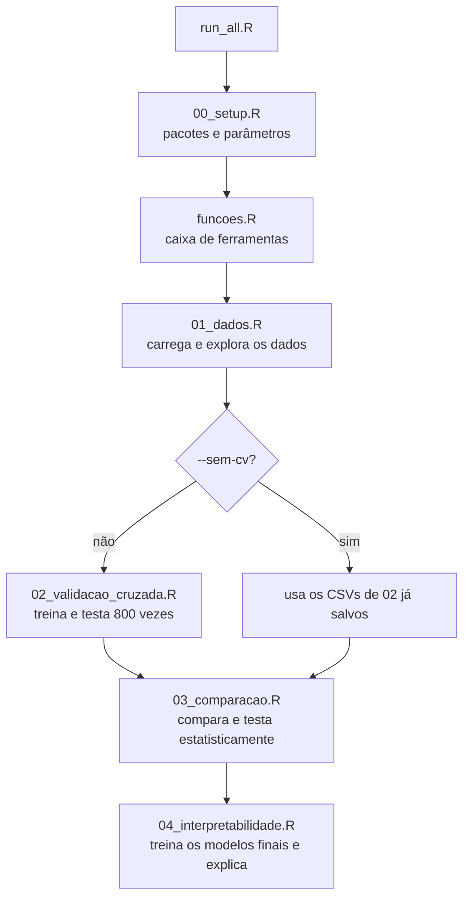

# Como este repositório funciona

Guia do funcionamento do código, arquivo por arquivo, em linguagem simples.
Para os **resultados** e as conclusões do TCC, veja o [README.md](README.md). Este guia explica **o que cada peça faz e como**.

---

## Sumário

1. [A ideia em uma frase](#1-a-ideia-em-uma-frase)
2. [Como rodar](#2-como-rodar)
3. [Mapa das pastas](#3-mapa-das-pastas)
4. [O fluxo completo, passo a passo](#4-o-fluxo-completo-passo-a-passo)
5. [Arquivo por arquivo](#5-arquivo-por-arquivo)
6. [O que tem em cada saída](#6-o-que-tem-em-cada-saída)
7. [Onde mexer para mudar alguma coisa](#7-onde-mexer-para-mudar-alguma-coisa)
8. [Glossário](#8-glossário)
9. [Perguntas frequentes](#9-perguntas-frequentes)

---

## 1. A ideia em uma frase

Pegamos dados clínicos de 768 pacientes, ensinamos **4 modelos** a prever quem tem diabetes, testamos cada um **50 vezes** de forma justa e comparamos **quão bem acertam** e **quão fácil é entender** por que acertam.

Os 4 modelos, do mais simples de entender ao mais "caixa-preta":

| Modelo | Em uma frase |
|---|---|
| Regressão logística | Uma fórmula: cada variável soma ou subtrai um pouco do risco. |
| Árvore de decisão | Uma sequência de perguntas do tipo "glicose ≥ 127?". |
| Random forest | 500 árvores diferentes votando. |
| Gradient boosting | Centenas de árvores pequenas, cada uma corrigindo o erro da anterior. |

---

## 2. Como rodar

**Pré-requisito:** R 4.1 ou mais novo. Os pacotes são instalados sozinhos na primeira execução.

| Onde | Comando | O que acontece |
|---|---|---|
| Terminal (na pasta do projeto) | `Rscript run_all.R` | Roda tudo do zero. |
| Terminal | `Rscript run_all.R --sem-cv` | Pula a parte lenta (validação cruzada) e reaproveita os resultados já salvos. Bom para só refazer as figuras. |
| RStudio | abrir `projeto_tcc.Rproj` → `source("run_all.R")` | Igual ao primeiro. |

Tudo o que aparece no console também é salvo em `resultados_log.txt`.

> **Importante:** rode sempre a partir da **raiz do projeto**. Os caminhos (`R/`, `resultados/`...) são relativos a ela. Abrir o `.Rproj` no RStudio já garante isso.

---

## 3. Mapa das pastas

```
projeto_tcc/
│
├── run_all.R                  ← o "botão de play": roda tudo em ordem
├── projeto_tcc.Rproj          ← abre o projeto no RStudio
├── resultados_log.txt         ← cópia de tudo o que foi impresso no console
├── README.md                  ← resultados e conclusões do TCC
├── READMEfunc.md              ← este guia
├── .gitignore                 ← o que o Git NÃO deve salvar
│
├── R/                         ← todo o código
│   ├── 00_setup.R             ← configurações (pacotes, semente, parâmetros, cores)
│   ├── funcoes.R              ← a "caixa de ferramentas" usada pelos outros scripts
│   ├── 01_dados.R             ← carrega os dados e faz a análise exploratória
│   ├── 02_validacao_cruzada.R ← treina e testa os modelos (a parte pesada)
│   ├── 03_comparacao.R        ← compara os modelos e responde aos objetivos
│   └── 04_interpretabilidade.R← mostra o que cada modelo "aprendeu"
│
├── data/
│   └── pima_bruto.csv         ← cópia dos dados originais (só para consulta)
│
├── resultados/
│   ├── tabelas/               ← todas as tabelas em CSV (e as regras da árvore em TXT)
│   ├── figuras/               ← todas as figuras em PNG, 300 dpi
│   └── modelos/               ← modelos finais em .rds (NÃO vai para o GitHub)
│
└── docs/
    └── rascunho_metodologia_resultados.md ← texto-base para o Projeto Completo
```

**Regra do nome dos arquivos:** o número no começo diz **qual script gerou** o arquivo.
`01_...` vem do `01_dados.R`, `03_...` vem do `03_comparacao.R`, e assim por diante.

---

## 4. O fluxo completo, passo a passo



Em palavras:

1. **Preparar o terreno** (`00_setup.R`): carrega os pacotes e define os números fixos do experimento.
2. **Carregar as ferramentas** (`funcoes.R`): só *define* funções, não roda nada ainda.
3. **Conhecer os dados** (`01_dados.R`): quantos pacientes, quantos zeros impossíveis, médias por grupo.
4. **Testar os modelos** (`02_validacao_cruzada.R`): 4 formas de tratar dados faltantes × 4 modelos × 50 testes = **800 avaliações**.
5. **Comparar** (`03_comparacao.R`): qual modelo foi melhor? A diferença é real ou sorte?
6. **Explicar** (`04_interpretabilidade.R`): treina cada modelo uma última vez com todos os pacientes e mostra quais variáveis ele usa.

---

## 5. Arquivo por arquivo

### 5.1 `run_all.R` — o botão de play

**O que faz:** executa os scripts na ordem certa e guarda o console em `resultados_log.txt`.

**Como faz:**
- Abre o arquivo de log com `sink()`. Tudo o que for impresso vai para a tela **e** para o arquivo.
- Chama `source()` em cada script, em ordem.
- Se receber `--sem-cv`, pula o `02_validacao_cruzada.R`.
- No final, imprime a versão do R e dos pacotes (`sessionInfo()`), para quem quiser reproduzir.

---

### 5.2 `R/00_setup.R` — configurações

**O que faz:** define tudo o que é "fixo" no experimento. Se quiser mudar um parâmetro, o lugar é aqui.

| Bloco | O que tem |
|---|---|
| **Pacotes** | Lista os 8 pacotes usados e instala os que faltarem. |
| **Parâmetros globais** | Os números que controlam o experimento (tabela abaixo). |
| **Caminhos** | Nomes das pastas; cria as que não existirem. |
| **Rótulos em português** | Traduz os nomes técnicos (`glucose` → "Glicose", `rf` → "Random forest"...). |
| **Cores e tema** | Uma cor fixa por modelo e o visual padrão de todas as figuras. |

**Parâmetros globais:**

| Nome | Valor | Significado |
|---|---|---|
| `SEMENTE` | 2026 | "Semente" do sorteio aleatório. Com o mesmo valor, o resultado sai sempre igual. |
| `K_FOLDS` | 10 | Em quantas partes os dados são divididos na validação cruzada. |
| `N_REPETICOES` | 5 | Quantas vezes a validação cruzada é repetida (10 × 5 = 50 testes). |
| `LIMIAR` | 0,5 | Acima de 50% de probabilidade, o modelo diz "tem diabetes". |
| `DELTA_AUC_RELEVANTE` | 0,05 | Diferença de AUC a partir da qual consideramos a perda "relevante" (objetivo 3). |
| `ESTRATEGIA_PRINCIPAL` | `"mice"` | Forma de tratar dados faltantes usada nas análises principais. |
| `VARS_ZERO_INVALIDO` | glicose, pressão, dobra cutânea, insulina, IMC | Variáveis em que **zero é impossível** e, portanto, significa "não medido". |

**Pacotes usados:**

| Pacote | Para quê |
|---|---|
| `mlbench` | Contém o dataset Pima. |
| `rpart` | Árvore de decisão. |
| `randomForest` | Random forest. |
| `gbm` | Gradient boosting. |
| `pROC` | Calcular a AUC e as curvas ROC. |
| `mice` | Imputação múltipla (preencher dados faltantes). |
| `ggplot2` | Figuras. |
| `partykit` | Desenhar a árvore de decisão. |

---

### 5.3 `R/funcoes.R` — a caixa de ferramentas

Este arquivo **não executa nada sozinho**. Ele só define funções que os scripts 01 a 04 usam.

> **Regra de ouro escrita no topo do arquivo:** tudo o que "aprende" com os dados (a mediana, o modelo de imputação) é calculado **só com os dados de treino** e depois aplicado ao teste. Se usássemos os dados de teste para isso, o modelo "colaria na prova" (*data leakage*) e o resultado ficaria otimista demais.

#### Parte 1: `zeros_para_na()`

Troca os zeros impossíveis por `NA` ("valor ausente") nas 5 variáveis da lista `VARS_ZERO_INVALIDO`.
Exemplo: um paciente com IMC = 0 passa a ter IMC = `NA`.

#### Parte 2: as 4 estratégias de dados faltantes

Todas recebem `(treino, teste)` e devolvem os dois já tratados.

| Função | Estratégia | Como funciona |
|---|---|---|
| `trat_zeros_mantidos` | Não fazer nada | Usa os zeros como se fossem medidas reais. Serve de **linha de base** para comparação. |
| `trat_casos_completos` | Jogar fora | Remove todo paciente com algum valor faltando. Sobram **392 de 768** pacientes. |
| `trat_mediana` | Preencher com a mediana | Calcula a mediana de cada variável **no treino** e usa esse número para preencher os buracos no treino e no teste. |
| `trat_mice` | Imputação múltipla (MICE) | Estima cada valor faltante a partir das outras variáveis do paciente. Por exemplo, "pacientes com IMC e idade parecidos costumam ter tal insulina". O modelo de estimativa é ajustado **só com o treino** (argumento `ignore`), e o diagnóstico de diabetes **não** é usado para preencher. |

A lista `ESTRATEGIAS` junta as 4 funções para que o script 02 possa percorrê-las num laço.

#### Parte 3: os 4 modelos (`MODELOS`)

Cada modelo tem duas funções:
- `ajustar(treino)` → treina o modelo;
- `prever(modelo, teste)` → devolve, para cada paciente, a **probabilidade de ter diabetes** (um número de 0 a 1).

| Modelo | Pacote | Configuração |
|---|---|---|
| `logistica` | `glm` (R base) | Todas as 8 variáveis, sem ajustes. |
| `arvore` | `rpart` | Cresce uma árvore grande e depois **poda** pela "regra do 1-SE": escolhe a árvore mais simples cujo erro está a no máximo 1 erro-padrão da melhor. Resultado: uma árvore pequena e legível. |
| `rf` | `randomForest` | 500 árvores; demais opções no padrão do pacote. |
| `gbm` | `gbm` | Até 1500 árvores de profundidade 3, com taxa de aprendizado 0,01. O número final de árvores é escolhido automaticamente pelo erro "fora da amostra" (OOB). |

Os hiperparâmetros são **fixos** (não há busca pelos melhores valores). Isso foi decidido de propósito, para não inflar o desempenho dos modelos complexos.

#### Parte 4: `calcular_metricas()`

Recebe o diagnóstico real e a probabilidade prevista e devolve 7 métricas (explicadas no [glossário](#8-glossário)):

| Métrica | Pergunta que responde |
|---|---|
| **AUC** (principal) | O modelo consegue colocar os doentes com probabilidade maior que os saudáveis? |
| Acurácia | Em quantos % dos pacientes ele acertou? |
| Sensibilidade | Dos que **têm** diabetes, quantos % ele encontrou? |
| Especificidade | Dos que **não têm**, quantos % ele liberou corretamente? |
| Precisão | Quando ele diz "tem diabetes", em quantos % está certo? |
| F1 | Média entre precisão e sensibilidade. |
| Brier | Quão perto as probabilidades ficaram da realidade (quanto **menor**, melhor). |

Todas as métricas, menos AUC e Brier, usam o corte de 0,5 (`LIMIAR`).

#### Parte 5: `criar_folds()`

Sorteia em qual das 10 partes ("folds") cada paciente vai cair, repetindo o sorteio 5 vezes.
É **estratificado**: cada parte fica com a mesma proporção de doentes (≈ 35%) que o total.

#### Parte 6: `teste_t_corrigido()`

Diz se a diferença de AUC entre dois modelos é **real ou só sorte**. Devolve a diferença média, o intervalo de confiança de 95% e o p-valor.

**Por que "corrigido"?** Na validação cruzada, os conjuntos de treino dos 50 testes se sobrepõem muito, então os resultados não são independentes. Um teste t comum acharia diferenças "significativas" com facilidade demais. A correção de Nadeau e Bengio (2003) aumenta a incerteza para compensar isso.

---

### 5.4 `R/01_dados.R` — conhecer os dados

**O que faz:** carrega o dataset e descreve os pacientes.

**Passo a passo:**
1. Carrega o **Pima Indians Diabetes** do pacote `mlbench` e salva uma cópia em `data/pima_bruto.csv`.
2. Conta os pacientes: 768 no total, 268 com diabetes (34,9%).
3. Conta os **zeros impossíveis** por variável. Insulina lidera, com 374 (48,7%).
4. Calcula média e desvio-padrão de cada variável, separando quem tem e quem não tem diabetes, e aplica um teste de Wilcoxon para ver se os grupos diferem.
5. Gera duas figuras: a barra de zeros inválidos e os boxplots por grupo.

**Saídas:** `01_zeros_invalidos.csv`, `01_descritiva.csv`, `01_zeros_invalidos.png`, `01_distribuicoes.png`.

---

### 5.5 `R/02_validacao_cruzada.R` — a parte pesada

**O que faz:** mede o desempenho de cada modelo de forma justa, sempre testando em pacientes que o modelo **nunca viu**.

**Como faz:** quatro laços, um dentro do outro.

```
para cada estratégia de faltantes (4)
  para cada repetição (5)
    para cada fold (10)
      1. separa: 1 parte vira TESTE, as outras 9 viram TREINO
      2. trata os faltantes (aprendendo só com o TREINO)
      3. para cada modelo (4)
           treina no TREINO
           prevê o TESTE
           calcula as 7 métricas
           guarda o resultado
```

Total: 4 × 5 × 10 × 4 = **800 linhas de resultado**.

**Detalhes que garantem justiça na comparação:**
- Os **mesmos folds** são usados para todos os modelos e estratégias. Todo mundo faz "a mesma prova".
- Antes de cada modelo, a semente é redefinida com o mesmo valor. A parte aleatória não favorece ninguém.

**Saídas:**
- `02_cv_por_fold.csv`: uma linha por estratégia × modelo × repetição × fold.
- `02_predicoes_oof.csv`: a probabilidade prevista para cada paciente em cada teste. Serve para desenhar as curvas ROC.

**Tempo:** alguns minutos. O MICE é a etapa mais lenta.

---

### 5.6 `R/03_comparacao.R` — comparar e responder aos objetivos

**O que faz:** transforma as 800 linhas em respostas. Se o script 02 foi pulado (`--sem-cv`), lê os CSVs salvos.

| Bloco | Pergunta | Como responde | Saída |
|---|---|---|---|
| **Resumo** | Quanto cada modelo acertou? | Média e desvio-padrão das 7 métricas nos 50 folds. | `03_resumo_desempenho.csv` |
| **Objetivo 2** | Os ensembles (RF, GBM) superam a logística? | Compara fold a fold a AUC de cada modelo com a da logística e aplica o teste t corrigido. | `03_logistica_vs_modelos.csv` |
| **Objetivo 3** | Quanto se perde ao trocar o melhor modelo por um interpretável? | Pega o modelo de maior AUC e mede a perda ao trocá-lo pela logística e pela árvore. A perda é "relevante" se passar de 0,05. | `03_objetivo3_perda_interpretabilidade.csv` |
| **Objetivo 4** | O jeito de tratar faltantes muda o resultado? | Compara cada estratégia com a linha de base (zeros mantidos). Também mede a **estabilidade**: variação da AUC entre folds. | `03_efeito_ausentes.csv` |

> A estratégia "casos completos" usa só 392 pacientes, então a comparação dela com as outras é **apenas descritiva**, sem teste estatístico. Não é justo comparar provas feitas com turmas diferentes.

**Figuras:** `03_auc_por_modelo.png`, `03_curvas_roc.png`, `03_estrategias_ausentes.png`.

---

### 5.7 `R/04_interpretabilidade.R` — o que cada modelo aprendeu

**O que faz:** treina cada modelo **uma última vez com os 768 pacientes** (dados preenchidos com MICE) e abre a "caixa" de cada um.

> Aqui **não se mede desempenho**. Isso já foi feito no script 02. O objetivo agora é só entender o raciocínio de cada modelo.

| Modelo | Como é explicado | Leitura |
|---|---|---|
| Regressão logística | **Odds ratio por +1 desvio-padrão** | "Se a glicose sobe ~30 mg/dL, a chance de diabetes fica 3× maior." As variáveis são padronizadas antes, para que os números sejam comparáveis entre si. |
| Árvore de decisão | **A própria árvore** + regras em texto | "SE glicose ≥ 127,5 E IMC ≥ 29,95 ENTÃO diabetes (73%)." |
| Random forest | **Importância por permutação** | Embaralha uma variável e mede quanto o modelo piora. Quanto mais piora, mais importante é a variável. |
| Gradient boosting | **Influência relativa** | Quanto cada variável contribuiu para as divisões das árvores. |

No final, todas as importâncias são colocadas na mesma escala (**100 = a variável mais importante daquele modelo**). Assim dá para ver se os 4 modelos concordam.

**Saídas:** `04_odds_ratios.csv`, `04_regras_arvore.txt`, `04_importancia_variaveis.csv`, as três figuras `04_*.png` e `resultados/modelos/modelos_finais.rds`.

---

## 6. O que tem em cada saída

### Tabelas (`resultados/tabelas/`)

| Arquivo | Uma linha é... | Colunas principais |
|---|---|---|
| `01_zeros_invalidos.csv` | uma variável | `n_zeros`, `pct_zeros` |
| `01_descritiva.csv` | uma variável | média (DP) geral, sem e com diabetes; nº de ausentes; p-valor |
| `02_cv_por_fold.csv` | um teste (estratégia × modelo × repetição × fold) | `n_treino`, `n_teste` e as 7 métricas |
| `02_predicoes_oof.csv` | um paciente em um teste | `id` do paciente, diagnóstico real `y`, probabilidade prevista `prob` |
| `03_resumo_desempenho.csv` | estratégia × modelo | `<métrica>_media` e `<métrica>_dp` |
| `03_logistica_vs_modelos.csv` | estratégia × modelo comparado | `diferenca_media` (modelo − logística), `ic95_inf/sup`, `p_valor`, `folds_modelo_vence` |
| `03_objetivo3_perda_interpretabilidade.csv` | estratégia × modelo interpretável | `perda_auc`, IC 95%, `perda_relevante` (> 0,05?) |
| `03_efeito_ausentes.csv` | modelo × estratégia | `auc_media`, `auc_dp`, `coef_variacao` (estabilidade), `delta_vs_zeros`, `p_valor` |
| `04_odds_ratios.csv` | uma variável | `odds_ratio`, IC 95%, `p_valor`, `dp_original` (quanto vale "+1 DP") |
| `04_importancia_variaveis.csv` | modelo × variável | `bruto`, `relativa` (0 a 100), `ranking` |
| `04_regras_arvore.txt` | — | a árvore final e as regras "SE... ENTÃO..." |

### Figuras (`resultados/figuras/`)

| Arquivo | Mostra |
|---|---|
| `01_zeros_invalidos.png` | Quantos zeros impossíveis cada variável tem. |
| `01_distribuicoes.png` | Boxplots de cada variável: com × sem diabetes. |
| `03_auc_por_modelo.png` | A AUC dos 50 testes de cada modelo. Cada ponto é um teste; o círculo é a média. |
| `03_curvas_roc.png` | Curvas ROC dos 4 modelos. |
| `03_estrategias_ausentes.png` | AUC de cada modelo nas 4 estratégias de faltantes. |
| `04_odds_ratios.png` | Odds ratios da regressão logística com IC 95%. |
| `04_arvore_decisao.png` | Desenho da árvore final. |
| `04_importancia_variaveis.png` | Importância das variáveis, lado a lado nos 4 modelos. |

---

## 7. Onde mexer para mudar alguma coisa

| Quero... | Onde | O quê |
|---|---|---|
| Trocar a semente | `00_setup.R` | `SEMENTE` |
| Mais ou menos repetições da CV | `00_setup.R` | `N_REPETICOES` (mais repetições = mais lento) |
| Mudar o corte de 50% | `00_setup.R` | `LIMIAR` (ex.: 0,3 para priorizar sensibilidade) |
| Mudar o critério de "perda relevante" | `00_setup.R` | `DELTA_AUC_RELEVANTE` |
| Usar outra estratégia de faltantes como principal | `00_setup.R` | `ESTRATEGIA_PRINCIPAL` (`"mediana"`, `"casos_completos"`...) |
| Mudar os hiperparâmetros de um modelo | `funcoes.R` | lista `MODELOS` |
| Adicionar um modelo novo | `funcoes.R` | nova entrada em `MODELOS` com `ajustar` e `prever` + rótulo e cor em `00_setup.R` |
| Adicionar uma estratégia de faltantes | `funcoes.R` | nova função `trat_...` na lista `ESTRATEGIAS` + rótulo em `00_setup.R` |
| Mudar cores ou visual das figuras | `00_setup.R` | `CORES_MODELOS` e `tema_tcc()` |
| Só refazer figuras depois de mexer no visual | terminal | `Rscript run_all.R --sem-cv` |

> Depois de mudar qualquer parâmetro que afete os resultados, rode **sem** `--sem-cv`. Senão, as figuras continuam usando os resultados antigos.

---

## 8. Glossário

| Termo | Explicação simples |
|---|---|
| **Treino / teste** | O modelo estuda com os dados de treino e faz a "prova" com os de teste, pacientes que ele nunca viu. |
| **Validação cruzada (k-fold)** | Divide os dados em 10 partes. Cada parte vira teste uma vez, enquanto as outras 9 treinam. Assim todo paciente é testado. |
| **Repetição** | Refazer a validação cruzada com outro sorteio das partes, para o resultado não depender de um sorteio de sorte. |
| **Estratificado** | O sorteio mantém a mesma proporção de doentes em todas as partes. |
| **Fora-do-fold (OOF)** | Previsão feita para um paciente quando ele estava no teste. |
| **Data leakage (vazamento)** | Quando informação do teste "vaza" para o treino. O modelo parece melhor do que realmente é. |
| **Dado ausente / NA** | Valor não medido. No Pima, aparece disfarçado de zero. |
| **Imputação** | Preencher valores ausentes com uma estimativa. |
| **MICE** | Imputação que estima cada valor faltante usando as outras variáveis do paciente. *pmm* (predictive mean matching) significa que o valor preenchido é sempre copiado de um paciente real parecido. |
| **AUC-ROC** | De 0,5 (chute) a 1 (perfeito). É a chance de o modelo dar probabilidade maior a um doente sorteado do que a um saudável sorteado. |
| **Curva ROC** | Gráfico de sensibilidade × falsos positivos para todos os cortes possíveis. A AUC é a área embaixo dela. |
| **Sensibilidade** | % dos doentes que o modelo detectou. |
| **Especificidade** | % dos saudáveis que o modelo classificou como saudáveis. |
| **Brier** | Erro médio das probabilidades. 0 = perfeito. |
| **Odds ratio (OR)** | Quantas vezes a chance de diabetes é multiplicada quando a variável aumenta. OR = 1: sem efeito; > 1: aumenta o risco; < 1: diminui. |
| **Intervalo de confiança 95% (IC)** | Faixa em que o valor verdadeiro provavelmente está. Se o IC de uma diferença inclui 0, não dá para afirmar que há diferença. |
| **p-valor** | Abaixo de 0,05, a diferença dificilmente é só sorte. |
| **Poda / regra do 1-SE** | Cortar galhos da árvore para ela não "decorar" os dados. O 1-SE escolhe a menor árvore que ainda é quase tão boa quanto a melhor. |
| **Ensemble** | Modelo formado por vários modelos juntos (RF e GBM). |
| **Hiperparâmetro** | Configuração escolhida antes de treinar (ex.: número de árvores). |
| **Semente** | Número que fixa o sorteio aleatório, para que o experimento dê sempre o mesmo resultado. |

---

## 9. Perguntas frequentes

**Os dados vêm do `data/pima_bruto.csv`?**
Não. O script `01_dados.R` carrega os dados direto do pacote `mlbench` e só **salva** uma cópia no CSV, para consulta. Editar o CSV não muda nada no experimento.

**Por que os resultados não mudam quando eu rodo de novo?**
Por causa da semente fixa (`SEMENTE = 2026`). Isso é proposital: qualquer pessoa que rodar o código chega aos mesmos números.

**Por que existem 4 estratégias de faltantes se a principal é o MICE?**
O objetivo 4 do TCC é justamente medir o impacto do tratamento de faltantes. As outras três servem de comparação. O MICE foi escolhido como principal **antes** de ver os resultados, para não escolher "a que deu melhor".

**Por que a árvore tem AUC bem menor?**
A árvore podada tem só 3 folhas. Por isso, ela dá apenas 3 valores de probabilidade diferentes (19%, 32% ou 73%) e ordena mal os pacientes dentro de cada grupo. Em troca, é o modelo mais fácil de explicar.

**Por que a pasta `resultados/modelos/` não está no GitHub?**
Os arquivos `.rds` são grandes e podem ser recriados rodando o código. O `.gitignore` os exclui.

**O que é o `resultados_log.txt`?**
Tudo o que foi impresso no console na última execução completa, incluindo as versões dos pacotes. Serve de "comprovante" dos números citados no TCC.

**Posso rodar só um script?**
Pode, mas antes é preciso rodar `00_setup.R` e `funcoes.R`, porque eles definem tudo o que os outros usam. Os scripts 02 e 04 também precisam do objeto `pima`, criado no `01_dados.R`. Na dúvida, use `run_all.R`.
